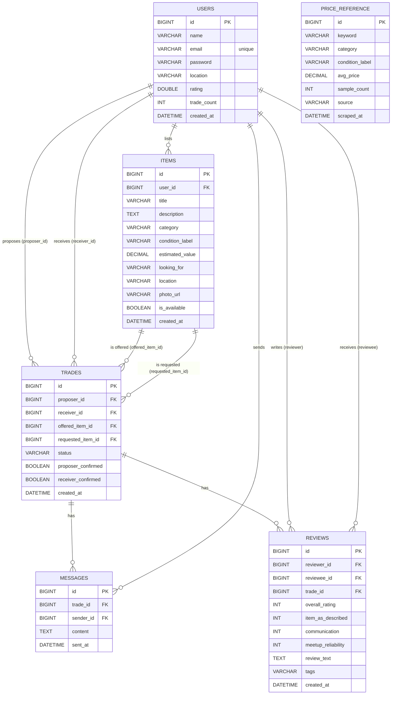

# HobbieTrades — Backend ERD (Current Implementation)

This ERD reflects the current Spring Boot JPA entities under `backend/src/main/java/com/hobbietrades/backend/model/`.

**Important scope note:** the diagram below is for the **implemented schema** (the 6 JPA entities). A separate section at the end lists **optional future tables** that are common in marketplace apps.

## ER Diagram (Mermaid)

## Relationship notes

### Core entities

- **User → Item (1:N)**: one user can list many items (`items.user_id`).
- **Trade** is the “transaction thread” that connects *two users* and *two items*:
  - `trades.proposer_id` and `trades.receiver_id` both reference `users.id`
  - `trades.offered_item_id` and `trades.requested_item_id` both reference `items.id`
- **Trade → Message (1:N)**: chat messages belong to a trade (`messages.trade_id`).
- **Trade → Review (1:N)**: reviews belong to a trade (`reviews.trade_id`).
- **PriceReference** is a lookup table for valuation and is currently **not FK-linked**.

### Constraints (as implied by code)

- **Unique email**: `users.email` is `@Column(unique = true)`.
- **One review per trade per reviewer**: enforced by repository check `findByReviewerIdAndTradeId(...)`.
  - Recommended DB-level index (optional): `UNIQUE(reviewer_id, trade_id)` to hard-enforce it.
- **Message content non-null**: `messages.content` is `nullable = false`.

### Lifecycle rules (behavior reflected in controllers/services)

- **Item availability**: `items.is_available` is set to `false` when a trade is completed (both parties confirmed).
- **Trade statuses**: `pending`, `accepted`, `declined`, `completed` (as used by `TradeController`).

## Recommended ERD extensions (marketplace-grade)

These are **not currently in your schema**. They’re listed here to show what you could add later without contradicting the current implementation.

- **Favorites / Saved items**: `favorites(user_id, item_id, created_at)`
- **Notifications**: `notifications(user_id, type, payload, read_at, created_at)`
- **Trade meetup**: `meetups(trade_id, location_text, scheduled_at, status)`
- **Audit / history**: `trade_events(trade_id, actor_user_id, type, payload, created_at)`
- **Item media** (multiple photos): `item_photos(item_id, url, sort_order)`

Additional common additions:

- **User sessions / refresh tokens**: `user_tokens(user_id, token_hash, expires_at, revoked_at)`
- **User reports / moderation**: `reports(reporter_id, subject_type, subject_id, reason, status, created_at)`
- **Category taxonomy** (if you want dynamic categories): `categories(id, name, emoji, parent_id)`

